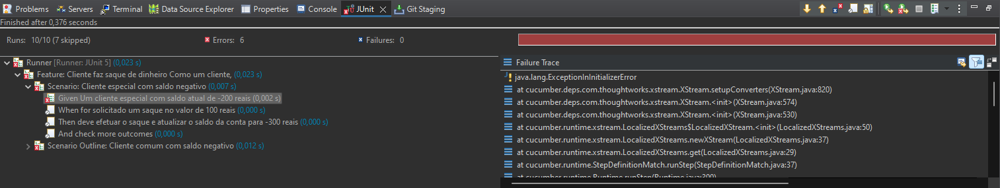

# Conta Bancária BDD

## Descrição do Projeto

Este projeto implementa funcionalidades de uma conta bancária usando Behavior-Driven Development (BDD) com a ferramenta Cucumber em Java. As funcionalidades incluem saques e verificações de saldo para clientes especiais e comuns.

## Estrutura do Projeto

- **Conta.java**: Contém a implementação das funcionalidades da conta, incluindo métodos para saques e verificação de saldo. Os métodos são anotados com expressões regulares que conectam os passos dos cenários escritos em Gherkin ao código Java.

- **arquivos_test.feature**: Arquivo que descreve cenários de teste em Gherkin. Esses cenários especificam diferentes situações relacionadas a saques em contas de clientes especiais e comuns.

-  **Runner.java**: Classe de execução dos testes. Utiliza a anotação `@RunWith(Cucumber.class)` para integrar os cenários Gherkin com a execução dos testes.

## Requisitos

- Java Development Kit (JDK) instalado.

## Funcionalidades Implementadas

### Cliente Especial

1. **Um cliente especial com saldo inicial negativo:**
    - Cenário: `Um cliente especial com saldo atual de -100 reais`
    - A conta é configurada com um saldo inicial de -100 reais.

2. **Solicitar um saque bem-sucedido:**
    - Cenário: `For solicitado um saque no valor de 50 reais`
    - A conta permite o saque e atualiza o saldo para -150 reais.

### Cliente Comum

1. **Um cliente comum com saldo inicial negativo:**
    - Cenário: `Um cliente comum com saldo atual de -50 reais`
    - A conta é configurada com um saldo inicial de -50 reais.

2. **Solicitar um saque sem fundos suficientes:**
    - Cenário: `Solicitar um saque de 100 reais`
    - A conta não permite o saque e mantém o saldo em -50 reais, retornando a mensagem "Saldo Insuficiente".
  
### Resultado no Console ao rodar os testes

